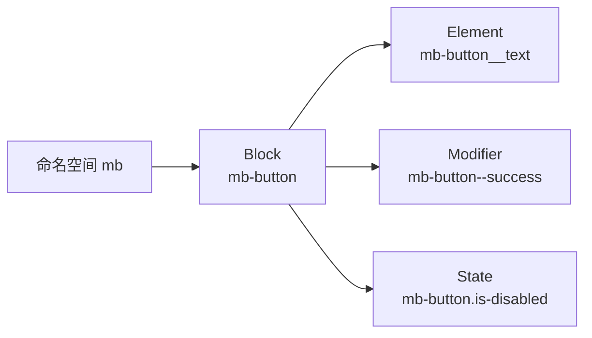

# 组件库

## 命名空间

 为了做样式隔离，否则在微前端的情况下一定会有样式冲突，我们不可以一直做垫板，那样无休止

## 依赖分开

 所谓的依赖分离，就是想所有依赖的包剥离在库之内，由外界的宿主环境提供（就是你现在运行的项目）

 ```js
  build: {
    lib: {
      entry: {
        index: path.resolve(__dirname, 'src/index.js'),
        locale: path.resolve(__dirname, 'src/core/i18n/index.js'),
      },
      name: 'MyComponents',
      formats: ['es']
    },
    rollupOptions: {
      // vue-office / file-saver / xgplayer 勿打进 dist 异步 chunk：
      // 宿主 webpack + npm link 会把相对路径 chunk 解析成错误 publicPath（如 localhost:60001/C_Users_...）
      external: (id) =>
        id === 'vue' ||
        id === 'element-plus' ||
        id.startsWith('element-plus/') ||
        id.startsWith('@element-plus/') ||
        id.startsWith('@vue-office/') ||
        id === 'file-saver' ||
        id === 'xgplayer' ||
        id.startsWith('xgplayer/'),
      output: {
        globals: {
          vue: 'Vue',
          'element-plus': 'ElementPlus'
        }
      }
    },
  },
 ```

## 样式隔离

 以element-plus为例子

- 创建空间scss
- 提供provider

```scss
@forward 'element-plus/theme-chalk/src/mixins/config.scss' with (
  $namespace: 'ep'
);
```

上述的文件可以在任何位置

来到vite,这一步才是真正修改的地方

```js
  css: {
    preprocessorOptions: {
      scss: {
        // 业务 scss 编译前注入 $namespace=ep；跳过 node_modules 避免循环
        additionalData: (source, filename) => {
          const file = typeof filename === 'string' ? filename : ''
          if (
            file.includes('node_modules') ||
            file.replace(/\\/g, '/').endsWith('styles/element/index.scss')
          ) {
            return source
          }
          return `@use "${elementNamespaceScss}" as *;\n${source}`
        },
      },
    },
  },
```

暴露你的命名空间

```js
export const YO_EP_NAMESPACE = 'ep'
```

在注册入口接受这个命名空间

```js
export default {
  install(app, options = {}) {
    app.use(ElementPlus, {
      locale: options.locale,
      namespace: options.namespace || YO_EP_NAMESPACE,
    })
  }
};

```

以上都是组件内部所做，外界所着做

- 引入命名空间

```js
import {YO_EP_NAMESPACE}  from  "xxx"
  app.use(yoPcUI, {
    namespace: YO_EP_NAMESPACE,
  })
```

- 来到根,修改运行时

```vue
<template>
  <YoConfigProvider :namespace="namespace">
    <div id="app">
      <router-view />
    </div>
  </YoConfigProvider>
</template>

<script>
import { YO_EP_NAMESPACE } from 'yo-pc-ui-component'

export default {
  name: 'App',
  data () {
    return {
      namespace: YO_EP_NAMESPACE
    }
  }
}
</script>

<style>
#app {
  font-family: 'Avenir', Helvetica, Arial, sans-serif;
  -webkit-font-smoothing: antialiased;
  -moz-osx-font-smoothing: grayscale;
  height: 100%;
}
</style>

```

## bem

什么是bem?

bem就是一种规范，何时产生block,何时产生element,什么时候产生修饰符，而这个也是element-plus实现样式的核心

- **B**lock：一块独立组件，例如按钮 `mb-button`
- **E**lement：块内部的零件，用 `__` 连接，例如文字 `mb-button__text`
- **M**odifier：块的变体，用 `--` 连接，例如成功色 `mb-button--success`
- **State**：状态类，用 `is-` 前缀，例如禁用 `is-disabled`

element-plus 两边一起写，类名才能对上：

- js 运行时往 DOM 上挂 class（`useNamespace`）
- css 编译时提前生成同名选择器（`@mixin b/e/m/when`）



### 先看实际效果

下面这组按钮就是 BEM 跑出来的样子。点一下会显示当前 DOM 上的 class。

<script setup>
import { computed, ref } from 'vue'

const ns = 'mb-button'
const active = ref('success')

const demos = [
  { id: 'primary', label: '主要按钮', extra: [`${ns}--primary`] },
  { id: 'success', label: '成功按钮', extra: [`${ns}--success`] },
  { id: 'warning', label: '警告按钮', extra: [`${ns}--warning`] },
  { id: 'disabled', label: '禁用按钮', extra: [`${ns}--primary`, 'is-disabled'] },
]

const current = computed(() => demos.find(item => item.id === active.value) || demos[0])
const classList = computed(() => [ns, ...current.value.extra])
</script>

<div class="bem-demo">
  <div class="bem-demo__row">
    <button
      v-for="item in demos"
      :key="item.id"
      type="button"
      class="mb-button"
      :class="item.extra"
      @click="active = item.id"
    >
      <span class="mb-button__icon" v-if="item.id === 'success'">✓</span>
      <span class="mb-button__text">{{ item.label }}</span>
    </button>
  </div>

  <pre class="bem-demo__code"><code>&lt;button class="{{ classList.join(' ') }}"&gt;
  &lt;span class="mb-button__text"&gt;{{ current.label }}&lt;/span&gt;
&lt;/button&gt;</code></pre>
</div>

<style scoped>
.bem-demo {
  margin: 16px 0 24px;
  padding: 16px;
  border: 1px solid var(--vp-c-divider);
  border-radius: 8px;
  background: var(--vp-c-bg-soft);
}

.bem-demo__row {
  display: flex;
  flex-wrap: wrap;
  gap: 12px;
}

.bem-demo__code {
  margin: 16px 0 0;
  padding: 12px 16px;
  border-radius: 6px;
  background: var(--vp-c-bg);
  overflow: auto;
}

.mb-button {
  display: inline-flex;
  align-items: center;
  gap: 6px;
  padding: 8px 16px;
  border: none;
  border-radius: 4px;
  color: #fff;
  background: #409eff;
  cursor: pointer;
  font-size: 14px;
}

.mb-button__text {
  display: inline-block;
  line-height: 1;
}

.mb-button__icon {
  font-size: 12px;
}

.mb-button--primary {
  background: #409eff;
}

.mb-button--success {
  background: #67c23a;
}

.mb-button--warning {
  background: #e6a23c;
}

.mb-button.is-disabled {
  opacity: 0.5;
  cursor: not-allowed;
  pointer-events: none;
}
</style>

对照关系（以命名空间 `mb` 为例）：

| 你写的 | 实际长出来 |
| --- | --- |
| `@include b(button)` / `ns.b()` | `.mb-button` |
| `@include e(text)` / `ns.e('text')` | `.mb-button__text` |
| `@include e(icon)` / `ns.e('icon')` | `.mb-button__icon` |
| `@include m(success)` / `ns.m('success')` | `.mb-button--success` |
| `@include when(disabled)` / `ns.is('disabled')` | `.mb-button.is-disabled` |

上面那组按钮，成功态完整 HTML 就是：

```html
<button class="mb-button mb-button--success">
  <span class="mb-button__icon">✓</span>
  <span class="mb-button__text">成功按钮</span>
</button>
```

对应编译后的 CSS：

```css
.mb-button { display: flex; }                 /* b(button) */
.mb-button.is-disabled { opacity: 0.5; }      /* when(disabled) */
.mb-button--success { background: #67c23a; }  /* m(success) */
.mb-button__text { display: inline-block; }   /* e(text) */
```

- 命名空间nameSpace -> config.scss

```scss
$namespace: 'eb' !default;  
$common-separator: '-' !default;
$element-separator: '__' !default;
$modifier-separator: '--' !default;
$state-prefix: 'is-' !default;
```

- 混合创建mixins

```scss
@use 'config.ui' as config;
@use 'sass:list';
@use 'sass:string';

$B: null;
$E: null;

// .mb-button
@mixin b($block){
 $B:config.$namespace + config.$common-separator + $blcok  !global;
 
  .#{$B}{
    @content;
  }
}

//.mb-button__text
// @include e(text icon) → .ui-button__text, .ui-button__icon
@mixin e($element){
  $E: $element !global;
  $selectors-list: ();


  @each $unit in $elemet {
    $class-name : '.' + $B + config.$element-separator + $unit;
    $select-list : list.append($select-list, string.unquote($class-name), comma);
  }

  @at-root{
    #{select-list} {
      @content;
    }
  }
}

@mixin m($modifier) {
  $selector: &;
  $currentSelector: '';

  @each $unit in $modifier {
    $currentSelector: #{$currentSelector + $selector + config.$modifier-separator + $unit + ','};
  }

  @at-root {
    #{$currentSelector} {
      @content;
    }
  }
}

// 命名空间带状态的后缀 如：.mb-button.is-disabled
@mixin when($state) {
  @at-root {
    &.#{config.$state-prefix + $state} {
      @content;
    }
  }
}

// 拼接变量名 如：--mb-button-text-color
@function join-var-name($list) {
  $name: '--' + config.$namespace;

  @each $item in $list {
    $name: $name + '-' + $item;
  }

  @return $name;
}

// 获取变量值 如：var(--mb-button-text-color)
@function css-var($args...) {
  @return var(#{join-var-name($args)});
}

// 设置变量值 如：--mb-button-text-color: #fff;
@mixin set-css-var($name-list, $value) {
  #{join-var-name($name-list)}: #{$value};
}
```

- 创建全局变量

```scss
@use 'sass:map';
@use './config';
@use './mixins' as *;
$colors: (
  primary: #409eff,
  success: #67c23a,
  warning: #e6a23c,
  danger: #f56c6c,
);
$button: (
  text-color: #fff,
  bg-color: map.get($colors, primary),
  border-radius: 4px,
  padding-x: 16px,
  padding-y: 8px,
);
:root{
  @each $name,$value in  $colors{
      @include set-css-var(('color', $name), $value);
  }
 @include set-css-var(('text-color','primary'), #303133);
}

@include b(button){
  display:flex; // 所有按钮的公共样式
  
  //.mb-button.is-disabled
  @include when(disabled){
   opacity: 0.5;
    cursor: not-allowed;
    pointer-events: none;
  }

  //.mb-button.my-button--success
  @include m(success){
    @include set-css-var(('button', 'bg-color'), map.get($colors, success));
  }

// .mb-button_text
  @include e(text) {
    display: inline-block;
  }
}
```

- js层面运行时

```js

import type { InjectionKey, Ref } from 'vue'
import { computed, getCurrentInstance, inject, ref, unref } from 'vue'

export const defaultNamespace = 'mb'
export const statePrefix = 'is-'
export const namespaceContextKey: InjectionKey<Ref<string>> = Symbol('namespaceContextKey')

function bem(namespace: string, block: string, blockSuffix = '', element = '', modifier = '') {
  let cls = `${namespace}-${block}`
  if (blockSuffix)
    cls += `-${blockSuffix}`
  if (element)
    cls += `__${element}`
  if (modifier)
    cls += `--${modifier}`
  return cls
}

function useGetDerivedNamespace(namespaceOverrides?: Ref<string | undefined>) {
  const derivedNamespace = namespaceOverrides
    ?? (getCurrentInstance() ? inject(namespaceContextKey, ref(defaultNamespace)) : ref(defaultNamespace))

  return computed(() => unref(derivedNamespace) || defaultNamespace)
}

export function useNamespace(block: string, namespaceOverrides?: Ref<string | undefined>) {
  const namespace = useGetDerivedNamespace(namespaceOverrides)

  const b = (blockSuffix = '') => bem(namespace.value, block, blockSuffix, '', '')
  const e = (element?: string) => (element ? bem(namespace.value, block, '', element, '') : '')
  const m = (modifier?: string) => (modifier ? bem(namespace.value, block, '', '', modifier) : '')
  const em = (element?: string, modifier?: string) => (element && modifier ? bem(namespace.value, block, '', element, modifier) : '')
  const is = (name: string, state = true) => (name && state ? `${statePrefix}${name}` : '')

  const cssVar = (object: Record<string, string>) => {
    const styles: Record<string, string> = {}
    for (const key in object) {
      if (object[key])
        styles[`--${namespace.value}-${key}`] = object[key]
    }
    return styles
  }

  const cssVarBlock = (object: Record<string, string>) => {
    const styles: Record<string, string> = {}
    for (const key in object) {
      if (object[key])
        styles[`--${namespace.value}-${block}-${key}`] = object[key]
    }
    return styles
  }

  return {
    namespace,
    b,
    e,
    m,
    em,
    is,
    cssVar,
    cssVarBlock,
  }
}

```

- 使用层

```vue
<script setup lang="ts">
import { computed, watch } from 'vue'
import { useNamespace } from '@/hooks/useNamespace'

const props = withDefaults(defineProps<{
  type?: 'primary' | 'success' | 'warning' | 'danger'
  plain?: boolean
  disabled?: boolean
  loading?: boolean
}>(), {
  type: 'primary',
  plain: false,
  disabled: false,
  loading: false, 
})

const emit = defineEmits<{
  click: [event: MouseEvent]
}>()

const ns = useNamespace('button')

const classes = computed(() => [
  ns.b(),
  ns.m(props.type),
  ns.m(props.plain ? 'plain' : undefined),
  ns.is('disabled', props.disabled),
  ns.is('loading', props.loading),
])


function handleClick(event: MouseEvent) {
  if (props.disabled || props.loading)
    return
  emit('click', event)
}
</script>

<template>
  <button type="button" :class="classes" @click="handleClick">
    <span v-if="loading" :class="ns.e('icon')">⏳</span>
    <span :class="ns.e('text')">
      <slot />
    </span>
  </button>
</template>
```

上面这个组件如果这样用：

```vue
<YoButton type="success" disabled>保存</YoButton>
```

运行时 DOM 就是：

```html
<button class="mb-button mb-button--success is-disabled">
  <span class="mb-button__text">保存</span>
</button>
```

`classes` 数组拆开看：

```js
ns.b()                         // 'mb-button'
ns.m('success')                // 'mb-button--success'
ns.is('disabled', true)        // 'is-disabled'
ns.e('text')                   // 'mb-button__text'
```
