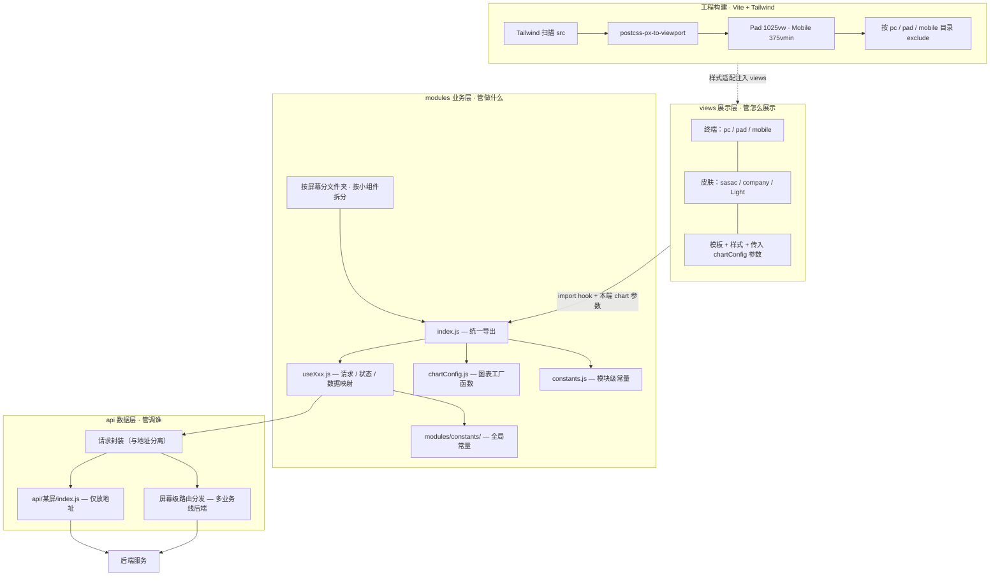

# 个人感悟

> 记录学习、工作与生活中的思考，与技术文档分开存放。

## 公共 → 大屏

### H5 / PC / Pad 混合

::: tip 背景
大屏项目往往需要同时适配 H5、PC、Pad 等多种终端，公共层的设计决定了后续维护成本。
:::

做了一段时间大屏之后，慢慢觉得可以这么拆：

**modules 管做什么，views 管怎么展示，api 管调谁。**

---

### 关于 API

接口最好按业务线放，比如 `src/api/某屏/index.js`。

我倾向于里面只放地址，请求本身另写——地址和请求分开，后面换 base path 或做多业务线会轻松很多。

同一套页面逻辑，不同业务线可能走不同后端（比如 `Alert` 和 `CapitalGroupAlert`），可以在屏幕级做一个路由分发，module 里就不用到处写 if/else 了。

另外，API 尽量不要塞在 `views` 下面。views 是展示层，api 是数据层，混在一起以后 modules 想复用会很别扭。同一份接口也别在 sasac、sasacLight、companyLight 里 copy 好几份。

---

### 关于 modules

多端大屏最怕的就是 PC、Pad、H5 各写一套逻辑，改一个功能改三遍。

所以公共的业务代码应该抽到 `modules` 里，按屏幕分文件夹，再按小组件拆，比如 `warning-trend`、`warning-overview` 这种。

每个小组件文件夹里，我目前是这么分的：

- **useXxx.js** — 发请求、组装数据、管状态，各端共用
- **constants.js** — 这个模块的字段、枚举，所有端一定是一样的
- **chartConfig.js** — 图表配置，必须用工厂函数，方便外面传不同尺寸、颜色
- **index.js** — 统一导出，views 只引这一层

大屏几乎一定有图表，各端样式不一样，但数据一样。工厂函数就是在这个场景下特别好用——逻辑一份，样式外面传。

modules 里不写 `if (isMobile)` 这类判断，终端差异留给 views。

---

### 关于常量

也分两级：

- **全局的**放 `modules/constants/`，比如轮询时间、分页条数
- **模块自己的**放各模块下的 `constants.js`，比如图例名、阶段名、字段 key

所有端要的字段一定是一样的，这个原则不能破。

---

### 关于 views

views 按终端（pc / pad / mobile）和皮肤（sasac / company / Light）分，本质上就是个壳子——引 module 的 hook，传入本端特有的图表参数，然后写模板和样式。

请求、数据映射、轮询这些，尽量别在 views 里写，下沉到 modules。

### 关于样式

如果非要使用taildwind.css 那么你必须给div起自己class 

```vue
    <template>
        <div class="detail"></div>
    </template>
```

```css
.detail{
    @apply w-[200px] h-[300px];
}
```


### taildwind配置

```js

// tailwind.config.js
export default   {
  content: [
    "./public/index.html",
    "./src/**/*.{vue,js}" // 扫描所有 Vue/JS 文件，确保类名被识别
  ],
  theme: {
    extend: {},
  },
  plugins: [],
}

```

```js

import { fileURLToPath, URL } from 'node:url'
import pxtoviewport from 'postcss-px-to-viewport-8-plugin'
import tailwind from '@tailwindcss/postcss'
import autoprefixer from 'autoprefixer'
import { defineConfig } from 'vite'
import vue from '@vitejs/plugin-vue'
import vueJsx from '@vitejs/plugin-vue-jsx'
import { visualizer } from 'rollup-plugin-visualizer'
import Components from 'unplugin-vue-components/vite'
import { ElementPlusResolver, VantResolver } from 'unplugin-vue-components/resolvers'

const PC_DIR = /[/\\]pc[/\\]/i
const MOBILE_DIR = /[/\\]mobile[/\\]/i
const PAD_DIR = /[/\\]pad[/\\]/i
const pcTableCssPath = /[/\\]pc[/\\].*table\.css$/i

/** 部分 CSS 经 Tailwind 处理后 rule.source 丢失，exclude 失效；补回 from 路径 */
function postcssEnsureSourceFile() {
  return {
    postcssPlugin: 'postcss-ensure-source-file',
    Once(css, { result }) {
      const from = result.opts.from
      if (!from) return
      css.walkRules((rule) => {
        if (!rule.source?.input?.file) {
          rule.source = rule.source ?? {}
          rule.source.input = { ...(rule.source.input ?? {}), file: from }
        }
      })
    },
  }
}
postcssEnsureSourceFile.postcss = true


// https://vite.dev/config/
export default defineConfig({
  css: {
    postcss: {
      plugins: [
        // 2. 交给 Tailwind CSS v4 官方 PostCSS 插件处理
        tailwind({legacy:true}),
        // 3. 最后自动添加浏览器前缀
        autoprefixer,
        postcssEnsureSourceFile(),
        // 1. 先进行 px 转 vw 的处理
        pxtoviewport({
          viewportWidth:1025,
          viewportUnit: 'vw',
          preserve: false,
          unitPrecision: 2,
          // rounded-full 极大 px 转 vw 会变成无效值（如 3.40282e1.13vw），圆角失效
          propList: ['*', '!border-radius'],
          minPixelValue: 1,
          mediaQuery: true,
          //include:/$\d*px$/,
          exclude: [PC_DIR, MOBILE_DIR, /node_modules/, pcTableCssPath],
        }),
        pxtoviewport({
          viewportWidth: 375,
         // viewportUnit: 'vw',
          viewportUnit: 'vmin', // 👈 这里改成 vmin
          fontViewportUnit: 'vmin', // 👈 建议把字体单位也同步改成 vmin
          preserve: false,
          unitPrecision: 2,
          propList: ['*', '!border-radius'],
          minPixelValue: 1,
          landscape: false,
          mediaQuery: true,
          exclude: [PC_DIR, PAD_DIR, /node_modules/, pcTableCssPath],
        }),
      ]
    }
  },
  envDir: './env',
  envPrefix: 'YOTECH_',
  base: '',
  build: {
    outDir: 'dist',
    rollupOptions: {
      output: {
        manualChunks(id) {
          if (!id.includes('node_modules')) return

          if (id.includes('element-plus') || id.includes('@element-plus')) {
            return 'element-plus'
          }
          if (id.includes('echarts') || id.includes('zrender')) {
            return 'echarts'
          }
          if (id.includes('vant')) {
            return 'vant'
          }
          if (id.includes('@tanstack')) {
            return 'tanstack'
          }
          if (id.includes('@vueuse')) {
            return 'vueuse'
          }
          if (/[\\/]node_modules[\\/](vue|vue-router|pinia)[\\/]/.test(id)) {
            return 'vue-vendor'
          }
          return 'vendor'
        },
      },
    },
  },
  server: {
    host: '0.0.0.0',
    port: 55026,
  },
  plugins: [
    vue(),
    vueJsx(),
    Components({
      resolvers: [ElementPlusResolver(), VantResolver()],
    }),
    process.env.ANALYZE === 'true' && visualizer({
      open: true,
      filename: 'dist/stats.html',
      gzipSize: true,
      brotliSize: true,
    }),
  ].filter(Boolean),
  resolve: {
    alias: {
      '@': fileURLToPath(new URL('./src', import.meta.url))
    },
  },
})
```

### 整体架构

> modules 管做什么，views 管怎么展示，api 管调谁。



